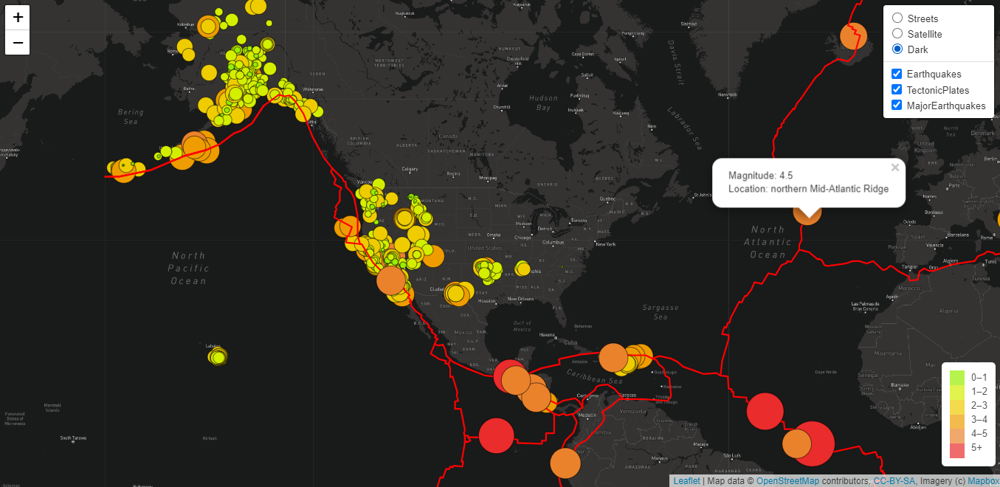

# Mapping_Earthquakes

## Project Overview
In this module, we used Leaflet.js Application Programming Interface (API) to populate geographical maps with GeoJSON earthquake data from a URL. Each earthquake will be visually represented by a circle and color, where a higher magnitude will have a larger diameter and will be darker in color. In addition, each earthquake will have a popup marker that, when clicked, will show the magnitude of the earthquake and the location of the earthquake.

## Sample of Webpage
